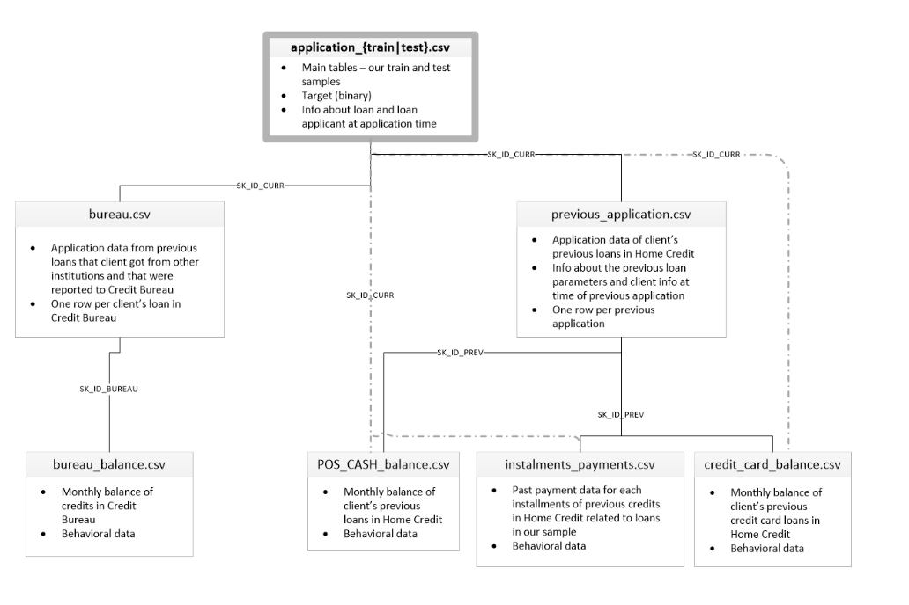

# 1. Thành viên nhóm

| Họ và tên      | MSSV |
| ----------- | ----------- |
| Nguyễn Phú Thụ| 19120673|
| Lê Anh Vũ| 19120724|

# 2. Giới thiệu dự án

## 2.1 Mô tả dự án

- Hiện tại nhiều người gặp khó khăn trong việc vay tiền vì lịch sử tín dụng không đầy đủ hoặc không tồn tại. Chính vì vậy, Home Credit mở rộng tài chính sách toàn diện cho những người chưa sử dụng dịch vụ bằng cách cung cấp các khoản vay tích cực và an toàn. Và điều này thường bị lợi dụng bởi những người không đáng tin cậy.

- Để đảm bảo mọi người có trải nghiệm tốt vay vốn tích cực, Home Credit sử dụng nhiều loại dữ liệu thay thế để dự đoán khả năng trả nợ của khách hàng. Từ đó đảm bảo rằng các khách hàng có khả năng trả nợ sẽ không bị từ chối và các khoản vay được cung cấp sẽ thanh toán đúng hạn.

## 2.2 Giới thiệu cấu trúc bộ dữ liệu

- **Gồm 3 phần chính**
    - Application: gồm dữ liệu tất cả các đơn đơn ký vay của Home Credit của trước và hiện tại.
    - Bureau: gồm dữ liệu bao gồm tất cả các khoản tính dụng trước đây của khách hàng được cung cấp bởi các tổ chức tài chính khác đã được báo cáo cho Phòng Tín Dụng của Home Credit.
    - Những bảng còn lại gồm dữ liệu liên quan đến lịch sử giao dịch của từng khoản vay.
    
    
## 2.3 Ứng dụng của đề tài

- Xây dựng mô hình dự báo khả năng có thể trả nợ của khách hàng dựa vào dữ liệu khách hàng trước đó của Home Credit và các tổ chính tài chính khác cung cấp cho Phòng Tín Dụng.

- Bằng cách xây dựng mô hình này chúng ta giúp nâng cao trải nghiệm của khách hàng về dịch vụ giúp thu hút khách hàng, từ đó không bỏ sót những khách hàng có khả năng trả nợ nhưng lại bị từ chối.

# 3. Hướng dẫn chạy source code
## 3.1 Clone source code
- git clone https://github.com/ShinNgao12/Final-Project-Applied-DS.git
- cd Final-Project-Applied-DS

## 3.2 Cài đặt thư viện cần thiết
-  pip3 install -r requirement.txt

## 3.3 Dataset Home Credit
-  Vì giới hạn của lưu trữ của github (data hiện là 2.67 GB) nên nhóm sẽ lưu trữ data trên google drive
https://drive.google.com/drive/u/0/folders/1LbBpsJHSXbq3G79bbcTEisz2vwRBW4SZ

# 4 Thông tin liên hệ

- Nếu nhóm bạn có thắc mắc nào có thể liên hệ qua email: npthu1202@gmail.com hoặc để lại issue tại github.
- Nhóm mình rất vui khi nhận được những ý kiến nhận xét từ nhóm các bạn.
